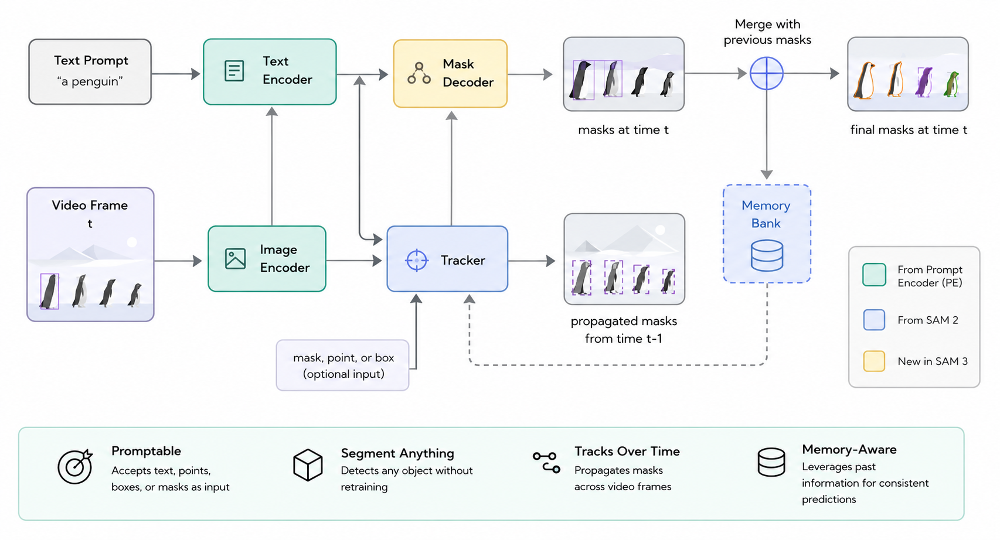

# SAM3 Video Segmenter

A minimal, user-friendly CLI wrapper around Meta's [SAM 3](https://github.com/facebookresearch/sam3) video predictor. Point it at a video and a text prompt (e.g. `"person"`, `"red car"`), and it segments and tracks every matching object across the video, writing a color-overlaid output video.

SAM 3's own API is a stateful session protocol (`start_session` / `add_prompt` / `propagate_in_video`) built for interactive tools. This wrapper hides that behind a single function call and a CLI.

## Setup

SAM 3 is not on PyPI — install it from source first:

```bash
git clone https://github.com/facebookresearch/sam3.git
cd sam3
pip install -e .
cd ..

pip install -r requirements.txt
```

You'll also need:
- A CUDA GPU (SAM 3 is an 848M-parameter model; CPU inference is impractical)
- Access to the SAM 3 checkpoints on Hugging Face — request access, then authenticate (`huggingface-cli login`) before first run. Checkpoints download automatically after that.

## Usage

```bash
python demo/run.py --video input.mp4 --prompt "person" --output segmented.mp4
```

Options:
- `--version` — `sam3` or `sam3.1` (default `sam3.1`, the newer multiplex checkpoints)
- `--checkpoint` — path to a local checkpoint instead of auto-downloading
- `--prompt-frame` — which frame index to attach the text prompt to (default `0`)
- `--compile` — enable `torch.compile` for faster repeated inference (SAM 3.1 only)

## Structure

```
sam3video/
  segmenter.py   VideoSegmenter — wraps the SAM3 session API into one generator call
  rendering.py   colored mask overlay + contour + object-ID labeling
demo/
  run.py         CLI entry point
```

## How it works



1. `start_session` opens the video (an MP4 path or a JPEG frame folder both work).
2. `add_prompt` attaches your text prompt to the chosen frame.
3. `propagate_in_video` streams `(frame_index, object_ids, binary_masks)` forward through the rest of the video, tracking every matched object.
4. Each frame is overlaid with its masks (per-object color, contour outline, ID label) and written to the output video in original order.

## Notes

- Propagation runs forward from `--prompt-frame`. Frames before it are written unmodified (no mask yet) — set `--prompt-frame 0` (the default) to segment the whole clip.
- This wrapper handles a single text prompt per run. For multi-prompt or interactive point/box refinement, use the SAM 3 library directly — see its `examples/sam3_video_predictor_example.ipynb`.
- Not tested end-to-end against the real model in this environment (no GPU / no checkpoint access here) — the session API calls match the verified source signatures in `sam3/model_builder.py` and `sam3/model/sam3_base_predictor.py`, but do a small test run on your own machine before relying on it.

## License

MIT
